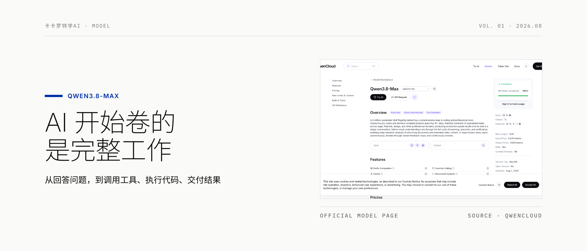

# kakarot-writer

> AI 文章最难改掉的，不是错字，而是那种“句句正确、没有一个活人在说话”的味道。

[](https://github.com/Zhangs-11/zs-skills)
[](https://github.com/Zhangs-11/zs-skills/commits/main)
[](../LICENSE)

kakarot-writer 把「卡卡罗特学AI」的选题判断、事实审查、叙事节奏和语言偏好沉淀成公众号长文工作流。它强调好奇、真诚、具体和可验证，不为了模仿文风编造亲历或堆固定口癖。



## 安装

```bash
npx skills add Zhangs-11/zs-skills --skill kakarot-writer
```

## 你可以这样说

- “根据这个产品 brief 写一篇公众号文章。”
- “按我的风格续写这篇稿子。”
- “把这份 PDF 和采访记录整理成长文。”
- “先核验素材里的事实，再出稿。”
- “写完后帮我配好公众号主封面和分享封面。”

## 工作流

1. 理解素材与选题，判断是否真的值得写。
2. 核验会影响结论的事实、时间、版本和原始来源。
3. 找到文章唯一的主线和读者能带走的东西。
4. 用自然段落完成初稿，再做反套路与事实审查。
5. 有 `guizang-social-card-skill` 时，默认用官方网页或 GitHub 等真实素材制作 `21:9` 主封面和 `1:1` 分享封面。
6. 交付 Markdown 长文；需要多平台分发时交给 `kakarot-repurposer`。

## 默认封面策略

公众号封面优先解决“看起来像真实内容，而不是 AI 概念图”这个问题。

默认调用 `guizang-social-card-skill`，选择 B 方案，从产品官网、官方文档、官方公告和 GitHub 仓库提取真实素材。完整来源保存在 `assets/SOURCES.md`，版面中保留克制的来源标识。主封面与分享封面分别排版，不做机械裁切。

只有环境里找不到专用封面 skill 时，才回退到 AI 图片，并明确告诉用户发生了回退。

## 前置条件与边界

- [ ] 安装 Agent Skills CLI，可先运行 `npx skills --help` 验证。
- [ ] 提供链接、PDF、brief 或原始笔记，素材越完整，文章越可靠。
- [ ] 如需默认的真实素材封面，安装 `guizang-social-card-skill`；未安装时会回退到 AI 图片。
- [ ] 确认文章中的亲历、采访、数据和测试结果均有真实依据。

小红书、推特、朋友圈等短内容应使用对应改写工具。纯标题与摘要任务也不属于本 skill。

## Troubleshooting

| 问题 | 解决方法 |
|---|---|
| 文章“AI 味”重 | 提供真实经历和判断，删掉套话并进行朗读检查 |
| 封面“AI 味”重 | 确认已安装 `guizang-social-card-skill`，并使用默认 B 方案抓取官方真实素材 |
| 标题比正文结论更强 | 回到事实源，降低标题承诺或补足正文证据 |
| 素材互相冲突 | 标明冲突与时间，优先原始来源，不强行拼成确定结论 |

完整风格与方法见 [SKILL.md](SKILL.md) 及 [references/](references/)。
