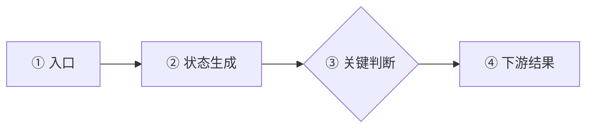

# 代码改动第一性审查

目标不是替改动者证明方案正确，也不是为了显得严格而强行找问题。无论审查同事还是自己的代码，都要在有限时间内回答六件事：这块功能负责什么、实际出了什么问题、根因是什么、代码链路怎样变化、改动是否合理、还有没有必须修正或补证的地方。

默认把读者视为第一次接触该项目的新手。输出仍保持短报告，只保留会影响理解、提交、合并决定或后续验证方式的信息；不要用一串术语和方法名代替解释，也不要把 Review 扩写成完整技术教程。

## 输入与边界

最低输入是一个可定位的审查对象，例如：

- CodeUp PR 链接；
- 当前仓库的 staged、unstaged 和 untracked 改动；
- 指定 worktree 路径或本地分支；
- 明确的 commit、patch 或比较范围。

需求背景通常应提供，但若当前对话、关联工作项、提交说明或代码能可靠恢复，就先自行整理；无法恢复时仍可做实现质量审查，但要明确“需求符合性未验证”。可选输入包括 OA 需求/缺陷 ID、project ID、Chat ID、环境、复现步骤、日志、改动者判断的根因和修复方案。

缺少可选输入时继续做能完成的静态审查，不把可自行检查的问题反问用户。只有审查对象无法访问、仓库或 worktree 无法定位、比较基线存在多个合理选择，或某个缺失选择会实质改变审查范围时才请求补充。

本 Skill 默认只读：

- 不修改代码、配置、数据库或文档；
- 不在 CodeUp 上评论、通过、关闭或合并 PR；
- 不 commit、push 或部署；
- 数据库只允许 SELECT；日志和配置只读取与当前假设有关的最小范围；
- 不在报告中回显 Token、Cookie、凭据、完整 Prompt 或未脱敏业务数据。

## 事实获取顺序

按成本从低到高取证，证据足够支撑结论就停止，不为低风险改动制造不成比例的调查。

### 1. 固定审查对象

先识别审查模式并在报告顶部写明“审查对象、基线、终点和包含范围”：

- **CodeUp PR**：解析仓库、源分支、目标分支、当前 patch set 和 commit。优先通过已登录页面、只读 OpenAPI 或对应 Git 远端取得不可变 diff，并读取 PR 描述、讨论和 CI。
- **当前未提交改动**：默认审查 `HEAD → 当前工作区`。分别读取 `git diff --cached`、`git diff` 和 `git ls-files --others --exclude-standard`；相关 untracked 文件必须读取，不能因普通 `git diff` 看不到就漏审。生成物、二进制或明确无关文件可以排除，但要在范围中说明。
- **worktree 或本地分支**：先用 `git worktree list`、`git status`、当前分支、HEAD 和远端信息确认实际路径。默认以用户指定目标分支为基线；未指定时只在仓库默认分支明确时使用其最新远端引用，并以 merge-base 为起点，审查 `merge-base → HEAD`，再叠加该 worktree 的 staged、unstaged 和相关 untracked 改动。基线不唯一时不要擅自选择。
- **commit 或 patch**：按用户明确给出的不可变范围审查，并记录两端 commit 或 patch 来源。

若 PR 与本地改动同时存在，默认把 PR 作为主审查对象；检查本地分支是否还有未进入 PR 的提交或工作区改动，并单独标为“PR 外本地改动”，不要混入 PR 结论。用户明确要求审查发布前全部内容时，再合并两部分范围。

涉及远端基线或 PR 时，先检查 `git status`、分支和 worktree，再 `git fetch`，使用最新远端引用判断；只审查当前工作区相对 `HEAD` 的未提交内容时不必为了形式强制 fetch。全程不得切换分支、改 index、stash、commit 或清理文件。

记录审查开始时的 HEAD、状态和 diff 范围；交付前重新检查。若用户或其他会话在审查中改变了 HEAD、index 或工作区，重新读取受影响 diff，或者明确报告审查基于哪个快照。无法取得真实 diff 时，不根据标题或描述假装完成代码审查。

### 2. 还原需求而不是复述需求

用大白话分别写清：

- **需求背景**：哪块功能本来负责什么；
- **问题描述**：在什么条件下，哪一步出现了什么偏离，造成什么实际影响；
- **改动者根因假设**：对同事改动，使用同事明确写出的判断；对自审，使用用户说明的判断。未明示时可从实际改动位置和方案反推，但必须注明“从代码改动反推，原文未明示”。

背景不要提前塞入根因；问题描述不要只写“逻辑有问题”“体验不好”或函数名。

### 3. 建立新手可读的最小词汇

只解释理解本次问题、根因和改动所必需的术语。术语第一次出现时，先给业务白话，再保留原词，例如：“幂等（同一条消息重复处理，也只能产生一次业务结果）”。缩写第一次出现时同时写出全称或实际用途。

对仍可能混淆的 3～6 个关键术语，使用“关键概念”小表格说明：

| 术语 | 白话解释 | 在本次问题里代表什么 |
|---|---|---|
| `<term>` | <不用另一个陌生术语循环解释> | <它在哪一步影响结果> |

不要罗列与结论无关的框架名、设计模式或基础语法。不要照抄注释和文档定义；先通过真实代码、配置或官方契约确认含义。项目自定义词语无法确认时注明“推断，未验证”。

### 4. 建立最小完整机制

从业务目标出发，追踪与改动有关的真实链路：

```text
输入/触发
→ 生产者
→ 状态或数据变更
→ 消费者
→ 用户可见结果
→ 错误恢复、异步回填或终态
```

只检查有真实调用关系的集成点，重点包括：

- 入口、调用方和下游消费者；
- 状态生命周期、缓存、并发、幂等和恢复路径；
- API/schema、数据库脚本、配置、提示词、前后端和跨仓依赖；
- 权限、环境差异、兼容路径、监控、测试和上线配套；
- 项目内同类实现、现行规范和历史修复先例。

如果当前目录属于 GoalfyAI，按需读取最新 `goalfy-coding` 规范、知识库导航和 `goalfy-insight` 的当前根因/证据合同；这些资料用于形成和校验假设，不能代替本次审查对象的代码与运行证据。

#### 把项目已有实现当作参考证据

审查改动前，按风险参考项目中最接近的现有代码、测试和必要历史，理解项目为什么这样设计、曾规避过什么问题。简单局部改动通常对照同模块最邻近的一处实现即可；涉及协议、Schema、序列化、跨服务接口或兼容行为时，再扩大到真实消费者、相同注册点、相关测试和历史修复。

优先选择与本次改动共享真实消费者、协议链路或业务约束的样本，不要只因函数名或字段名相似就类比。现有代码是高价值参考，不是必须照搬的规则：它也可能过时、只覆盖另一场景或本身存在缺陷。若新写法与项目惯例不同，检查差异是否来自明确的新需求、版本变化或消费者差异，并要求用针对性测试证明；不能只以“更标准”“更通用”或外部文档允许为理由。

找不到可靠样本时，记录实际搜索过的模块和关键词，再依据真实消费者、官方当前契约或最小运行探针判断；不要为了凑参考随便找一段不相关代码，也不要仅因项目没有先例就阻塞低风险改动。报告只需在“验证情况”中简要写明真正影响结论的参考样本及其启示，避免展开成代码考古记录。

### 5. 独立判断根因

不要从“改动者改了这里”倒推“这里一定是根因”。依次确认：

1. **现象**：用户或系统最终看到了什么；
2. **触发条件**：本次什么事件启动了异常链路；
3. **首次有意义的偏离**：最早哪个值、状态、分支或结果偏离预期；
4. **直接原因**：什么机制直接造成问题；
5. **系统根因**：现有约束、门禁、恢复或消费链为什么没有阻止直接原因；
6. **反事实**：若移除候选根因，是否应观察不到当前问题。

至少检查一个竞争解释，例如配置/版本不一致、调用方错误、外部依赖、权限、数据、模型决策或证据不足。结论分为：

- **一致**：改动者判断和独立核验指向同一首次偏离与机制；
- **部分一致**：改动者找对了直接原因，但漏了更早根因或影响范围；
- **不一致**：实际修改点不能解释现象，或证据支持另一原因；
- **无法判断**：缺少会改变因果判断的决定性事实。

最新 `main` 只说明当前设计，不能证明某环境已经部署；代码默认值也不能冒充 Nacos、数据库、Hub 或环境变量的当前值。结论依赖运行时事实而输入未提供环境时，明确写“运行时未验证”。

### 6. 绘制代码链路与改动对比

先还原真实调用链和数据流，再绘图；不要从文件 diff 拼出一张看似完整但没有调用证据的图。图用于帮助零背景读者理解改动，不代替根因判断和代码证据。

优先使用 Mermaid `flowchart LR` 展示每条代码链路。采用两层结构：

1. **主链路**：把“改动前”和“改动后”拆成两张独立图，改动前在上、改动后在下，形成纵向对比；每张图内部仍按 `LR` 从左到右展示链路。两图使用一致的业务阶段、节点编号和粒度，便于上下逐项比较。每条主链保留 5～8 个节点，只表达入口、关键生产者、状态变化、决定性判断、消费者和最终结果。
2. **关键判断展开**：主链中的判断较复杂时，另画一张局部图，只展开本次修改的判断、造成问题的判断，以及影响成功、失败或恢复路径的判断。未修改且与结论无关的分支合并为“既有校验（未修改）”或“其他正常路径保持不变”。

主图使用以下骨架。必须输出两个独立 Mermaid 代码块，依靠文档顺序实现稳定的上下对比；不要把两个版本合并进同一个 `subgraph` 或泳道图。根据真实代码替换节点，不要照抄示意内容。

#### 改动前



#### 改动后


每张图最多放 3 个判断节点；超过时拆成主链和一个或多个局部判断图，不画完整控制流图。跨文件、模块或仓库时使用 `subgraph` 标出边界，但仍保持一条从左到右的业务主线。节点标签必须先写业务作用，再换行补真实方法或状态名，例如 `确认支付结果<br/>confirmPayment()`；不能只写陌生代码标识符。

图中用编号 `①②③` 关联后面的代码证据，并保持统一语义：

- 灰色：未修改链路；
- 红色或虚线：原问题路径、被删除路径；
- 绿色：新增或修复路径；
- 黄色菱形：关键判断；
- 虚线边框：根据改动推断但未由调用链或运行证据确认的节点，并明确标“推断，未验证”。

每个关键节点都要能追溯到锁定审查对象中的真实代码。对影响问题链路的 3～6 个关键方法，不能只列方法名；必须根据方法体、调用方和被调用方说明：

- 谁在什么条件下调用它；
- 输入的业务含义，不必机械抄 Java/TypeScript 类型；
- 它做的核心事情；
- 返回值、状态写入、消息发送等输出或副作用；
- 它为什么与本次问题或改动有关。

若方法名与实际行为不一致，以真实实现为准。仅从名字或注释推断用途时标注“推断，未验证”。代码证据注明仓库、文件、函数和行号；改动前引用基线 commit，改动后引用 PR 源 commit、当前 HEAD 或明确标记的工作区快照。片段每段通常 5～12 行、最多 3 段，只截取决定行为的部分。不得把伪代码冒充真实代码；确需简化时标注“伪代码示意”。

若改动只有一个简单条件或单点字段调整，图不会增加理解价值，可以省略主图，直接用链路对比表和代码证据；不要为满足格式强行画图。

### 7. 审查改动与遗漏

把当前审查范围内的改动视为一个待证伪方案：

- 改动是否截断了已确认的因果链，而不是只隐藏症状；
- 正常路径、失败路径和恢复路径是否都保持正确；
- 设计写到的检查是否全部实现；
- 是否混入无关重构、未来兼容或另一个需求；
- 新增状态、字段、API 或表是否有完整生产者和消费者；
- 测试是否覆盖复现条件、正常路径和关键回归；
- CI 通过是否真的覆盖该风险，还是只有形式上的绿灯。

先寻找能推翻每条候选 finding 的反证。只有满足以下条件才写进正式问题：

- 能指向具体文件、行号、配置、日志或运行事实；
- 有可达路径或明确消费者；
- 能说明触发条件和实际影响；
- 修正它会改变提交、合并决定或验证方式。

不要规定必须找到问题。默认最多展开 3 个正式问题，按“阻塞 / 建议”分级；其余不影响正确性的观察可省略。

#### 跨层契约等价性：通过结论前的强制门禁

只要改动新增或收紧校验器、解析器、Schema、序列化、路由或兼容层，就把上游和真实消费者各自接受的输入看成两个集合。不能因为两边字段同名、注释声称一致、都使用“cron/JSON/URL”等同类库，或现有测试全绿，就推断契约等价。

1. **写出真实消费操作**：追到最终消费者实际执行的动作，例如 `getattr(module, entry)`、具体 cron parser、反序列化类型、数据库约束或协议状态机；注释中的“必须”“合法”“已处理”只是待验证主张。
2. **双向寻找差集**：分别寻找“上游放过、下游拒绝”的假阴性和“下游可处理、上游误拒绝”的假阳性。至少构造一个标准合法输入、一个替代但合法的兼容写法、一个非法输入和一个边界输入；别名、导入名、描述符、可选字段、空值和历史格式按真实契约选择，不机械套用。
3. **同样例对照不同实现**：两层使用不同语言、库或版本时，用同一组输入分别实测；不能从函数名相似或文档摘要推断语法完全相同。若无法运行其中一端，读取实现或官方当前契约并把该格标成未验证，不能无条件通过。
4. **检查存量重校验**：部分更新若会先合并旧配置再跑完整校验，必须加入“合法存量配置 + 只改无关字段”的回归格。新增门禁不能让消费者一直可用的旧配置，在改展示名、列定义或样例文件时突然无法保存。
5. **把现有测试当覆盖地图**：先列出作者测试已经覆盖的输入形态，再主动生成集合边界之外的反例。测试全绿只证明这些样例，没有覆盖的等价写法和跨层差集仍是未知。

存在会造成下游必然失败或存量合法输入被上游阻断的未验证差集时，结论至少为“基本合理，需补充”；已有静态证据或实测反例时，应判为“需要修正”。

#### 验收覆盖矩阵：通过结论前的强制门禁

当一个需求存在多个真实入口、角色、协议分支，或同一输入中可能同时出现多个独立状态时，不能用“主流程通过”“请求已拦截”或“测试是绿的”代替完整验收。先从需求、验收标准和真实调用链生成最小覆盖矩阵，再决定是否可以给出通过结论。

1. **穷举真实入口**：从注册点和调用方追到实际执行分支，至少覆盖主入口、提前路由、别名/兼容入口、Hook、重试/恢复和异步入口中与本次契约有关的可达路径。名字相同不代表走同一实现；共享方法也不代表调用前后的行为一致。
2. **拆解输入维度**：为每个入口列出正常、单一异常和边界输入。若两种状态能在同一次请求中共存，必须增加混合输入；不能只分别测试 A、B 就推断 A+B。根据风险选择有意义的组合，不机械生成无业务价值的笛卡尔积。
3. **核对完整输出契约**：每个格子不仅判断成功/失败，还要核对是否继续调用下游、是否产生消息/写入/上报等副作用、错误是否包含全部原因、状态和错误码是否一致、不同入口是否遵守同一语义。“拒绝了请求”只能证明安全门禁生效，不能证明诊断信息和验收契约完整。
4. **标记证据等级**：每格写明 `运行测试`、`静态调用链` 或 `未验证`。现有测试绿灯只能覆盖它实际断言的格子；没有断言的入口、组合和副作用仍是未验证。

按需在 Review 的“验证情况”中加入精简矩阵；不必展示低风险、重复的格子，但内部检查不能省略关键入口和混合状态：

| 真实入口 / 角色 | 输入或状态组合 | 预期控制流 | 预期输出与副作用 | 证据 |
|---|---|---|---|---|
| `<入口 A>` | 正常 | 继续下游 | 成功结果；副作用一次 | 运行测试 |
| `<入口 A>` | 异常 X + 异常 Y | 不继续下游 | 同时说明 X/Y；失败状态完整上报 | 静态调用链 |
| `<入口 B>` | 同一混合输入 | 与入口 A 一致 | 与入口 A 语义一致 | 未验证 |

只要存在会改变合并决定的关键格子仍为“未验证”，就不能写“合理”“未发现其他问题”或“所有入口一致”；应降级为“基本合理，需补充”或“证据不足”，并准确列出缺口和最短验证动作。修正上一轮 finding 后，必须基于最新 patch set 重新生成或复核整个矩阵，不能只回归上一轮问题。

#### 重试、取消与诊断链路：表面正确不等于控制流正确

当改动涉及重试、连接重建、取消、超时、流式响应或错误正文提取时，最终错误文案正确、返回足够快和测试绿灯都不能单独证明控制流正确。Review 必须额外执行以下门禁：

1. **找出重试决策的唯一权威输入**：分别追踪最终对外异常、连接/取消等辅助标志、owner task 退出状态和清理阶段异常。若它们可能在同一次操作中同时出现，必须测试发生顺序和冲突组合；特别警惕 `辅助标志 OR 异常分类` 让本应不可重试的最终异常重新进入重试。最终异常已经明确表达不可重试契约时，辅助状态不能绕过这道硬门禁。
2. **用次数和副作用证明“没有重试”**：除错误类型、文案和耗时外，必须断言下游实际调用次数、连接重建次数，以及写库、发消息、调用外部接口等副作用次数。一次写操作即使最终返回正确错误，也可能已经重复执行；没有这些断言的测试不能证明幂等或不重试。
3. **按协议的等价表示测试错误正文**：读取 HTTP 或流式错误正文时，至少覆盖有 `Content-Length`、无长度/分块、空正文、超限截断、读取失败和关闭失败。测试替身只返回最理想的固定长度响应，会隐藏真实传输差异；诊断 helper 和资源清理也不得覆盖原始业务异常。
4. **要求风险断言能抓住旧缺陷**：针对上述关键行为，确认新增测试在缺少修复或恢复缺陷逻辑时确实会失败。只覆盖错误字符串或总耗时、却无法识别重复调用和正文丢失的测试，只能算表象回归，不能作为通过证据。

这组门禁来自一次已发生的漏检模式：审查把“最终异常不可重试”和“取消会设置连接异常标志”分开验证，却没有组合验证；测试只断言了可见错误和耗时，没有断言调用次数；HTTP 替身始终携带 `Content-Length`，没有暴露无长度响应会丢失真实错误正文；资源关闭失败也可能反过来遮蔽原始异常。以后遇到同类控制流，必须把这些冲突状态、传输表示和清理失败纳入同一验收矩阵。

#### 最小必要改动：逐 hunk 证明范围合理

正确性通过不代表 diff 可以无限扩张。逐个 diff hunk（同一处连续修改）回答“它直接满足哪条需求、修复哪个已证实问题，或为哪项必要测试提供支撑”；无法给出具体对应关系的改动默认视为范围外，而不是用“顺手优化”“更干净”“以后可能有用”证明合理。

- **禁止无意义格式噪音**：多余空行、无关缩进/换行、引号或 import 排序、全文件格式化、与目标无关的命名调整都会增加冲突并掩盖真实逻辑。只有项目强制格式化工具对本次触碰区域的必要输出才能保留，并说明证据。
- **保护仍正确的注释和文档**：删除或改写注释前，必须证明它已错误、重复、误导，或因对应代码被删除而失效。注释仍准确且对约束、历史原因、调用方或异常策略有解释价值时应保留；“代码已经能看懂”不是删除理由。
- **拒绝顺手重构和未来设计**：无关 helper 抽取、目录搬迁、接口泛化、兼容层、低概率兜底、性能优化和依赖升级，若不是当前需求的必要条件，应从本 PR 移除或拆分并另行授权。不要因已经写完或测试通过就降低范围标准。
- **审查增删两侧**：不仅检查新增代码是否有消费者，也要检查删除的函数、注释、测试、错误处理和兼容行为是否确实无用。删除仍正确内容属于真实回归风险，不是代码精简。

将范围外改动作为正式 finding：纯噪音或少量无关清理通常列为“建议”；会删除正确契约、扩大行为边界、增加维护面或显著提高冲突风险时列为“阻塞”。通过结论前应能把所有保留 hunk 映射到需求、根因、必要测试或强制工具输出。

### 8. 形成可执行的建议改动

在报告最末尾输出“建议改动”，用编号逐条写完整文案，默认最多 3 条。每条通常写 2～4 句话，并包含：

1. **改哪里**：指出文件、方法、配置或测试场景；
2. **为什么改**：说明当前行为、触发条件和实际风险；
3. **怎么改**：给出符合项目现有结构的最小调整方向，必要时附少量伪代码；
4. **改完怎样算正确**：写清预期行为和最短验证方式。

建议与正式 finding 一一对应时标明“对应问题 1/2/3”，不要重复大段问题描述。不要只写“补测试”“加判空”“优化逻辑”或“注意幂等”这类过度精简的短句，也不要在只读 Review 中直接修改代码。

若没有必须修改的问题，仍保留本节并明确写“本次未发现必须修改项”，不要为了填满模板制造建议；可以补充一条有证据且明显降低风险的验证建议。若证据不足，优先建议获取哪项事实或执行哪项测试，不要在根因未确认时建议猜测性改代码。

## 结论口径

- **合理**：未发现阻塞问题，根因和改动链路有足够证据；
- **基本合理，需补充**：主体正确，但有非阻塞遗漏、测试或说明需要补齐；
- **需要修正**：存在可复现或可达的正确性问题，提交或合并前应修复；
- **证据不足**：真实 diff 不可得、比较基线不明确，或缺少会实质改变根因判断的运行时事实。

“证据不足”不是找不到问题时的兜底。静态证据足以判断的内容仍要给出明确结论，只把依赖缺失事实的部分标记未验证。

## 输出格式

使用下面结构，但让内容自然、紧凑。没有正式问题时删除“发现的问题”；没有必要代码片段时不贴代码；“建议改动”始终作为最后一节保留。

```markdown
# Review 结论

结论：合理 / 基本合理，需补充 / 需要修正 / 证据不足
仓库：<repo>
审查对象：<CodeUp PR / 当前工作区 / worktree / 分支 / commit / patch>
范围：<base commit → head commit；staged / unstaged / untracked；必要时注明排除项>
PR：<url；没有则删除本行>

## 需求背景
<两三句话，让不了解需求的人知道是哪块功能>

## 问题描述
<触发条件 → 哪一步出错 → 实际影响>

## 关键概念

| 术语 | 白话解释 | 在本次问题里代表什么 |
|---|---|---|
| <只列理解后文必需的 3～6 个术语；没有则删除本节> | <一句白话> | <和当前链路的关系> |

## 根因判断
<独立确认的根因；无法闭合时明确缺什么事实>

| 对比项 | 改动者判断 | 复核结论 |
|---|---|---|
| 根因 | <原文或从代码改动反推> | 一致 / 部分一致 / 不一致 / 无法判断：<一句理由> |

## 代码链路与改动对比

### 主链路

#### 改动前

<独立的 `flowchart LR` Mermaid 图；简单单点改动可省略，并说明原因>

#### 改动后

<独立的 `flowchart LR` Mermaid 图；与改动前使用相同阶段、编号和粒度>

### 关键判断展开

<仅在主链包含复杂判断时绘制局部横向图；否则删除本节>

| 链路 | 改动前 | 改动后 | 判断 |
|---|---|---|---|
| <关键节点> | <原逻辑> | <新逻辑> | <是否截断根因及副作用> |

### 关键方法与代码证据

| 节点 / 方法及来源 | 谁调用、何时调用 | 输入 | 白话作用 | 输出或副作用 | 为什么与问题有关 |
|---|---|---|---|---|---|
| <① `method()` · `repo/path:line` · 版本> | <上游与触发条件> | <业务含义> | <这个方法实际做什么> | <返回、写状态、发消息等> | <它决定了哪一步结果> |

<按需附最多 3 段关键代码；每段注明来源和版本>

## 发现的问题

1. [阻塞/建议] `<file:line>`：<问题、触发条件和影响>。建议：<最小修正或验证方式>。

## 验证情况
已验证：<diff、调用链、规范、测试、日志或配置；按需注明参考的同类实现及其启示>
未验证：<只列可能改变结论的缺口；没有则写“无关键缺口”>

## 建议改动

1. [必须/建议，对应问题 N] 建议调整 `<file:line / method()>`。<当前行为在什么条件下会造成什么影响>。<推荐采用的最小改法及其与现有实现的关系>。完成后应通过 <测试或可观察结果> 确认问题已解决且正常路径未回归。

<没有必须修改项时写：本次未发现必须修改项。现有实现已覆盖……；如需进一步降低风险，建议……，验证标准是……。>
```

先给结论，不复述调查过程，不罗列完整检查清单。专业词第一次出现时立即用白话解释；finding 也要说明业务影响，不能只写技术名词。图、表和代码片段只服务于理解根因与改动；如果它们表达的是同一件事，保留最清楚的一种，不重复堆砌。

## 完成检查

交付前确认：

- 背景、问题和根因没有互相重复或偷换；
- 改动者的判断被当作假设独立核验；
- 审查对象、比较基线、PR diff、本地未提交内容和必要运行时事实没有混为一谈；
- staged、unstaged、相关 untracked 和 worktree 内未提交内容没有被静默遗漏；
- 链路图来自真实调用关系，改动前图在上、改动后图在下且阶段对齐，复杂判断已拆分，节点能追溯到具体代码和版本；
- 关键术语已有白话解释，关键方法已说明调用者、输入、核心行为、输出及其与问题的关系；
- 方法用途来自真实实现和上下游，不是根据名字或注释猜测；
- 每个正式问题都有位置、可达路径、触发条件和影响；
- 已按风险参考项目内最接近的同类实现、测试或历史修复，理解其设计理由；没有机械照搬旧代码，也没有用不相关样本强行类比；
- 新增或收紧校验、解析、Schema 或兼容逻辑时，已写出真实消费者操作，并双向检查“上游放过/下游拒绝”和“下游接受/上游误拒绝”；
- 跨语言、跨库或跨版本的同一概念已用同一组标准、兼容、非法和边界样例对照，未从同名方法或测试绿灯推断契约一致；
- 部分更新会合并旧配置并完整重校验时，已覆盖“合法存量配置 + 无关字段更新”，确认新增门禁没有制造兼容性回归；
- 存在多入口或可共存状态时，已从验收标准和真实调用链核对“入口 × 输入/状态 × 完整输出/副作用”矩阵；关键混合输入没有被单项测试替代；
- 涉及重试、取消或连接重建时，已组合验证最终异常与辅助状态冲突，并由不可重试契约对重试决策形成硬门禁；
- “不重试”“幂等”或“只执行一次”已通过真实调用次数和全部关键副作用次数证明，没有只断言错误文案或耗时；
- 读取 HTTP/流式错误正文时，已覆盖有长度、无长度/分块、空正文、超限、读取失败和关闭失败，且诊断与清理异常不会覆盖原始错误；
- 针对风险的新增测试已确认能在缺少修复或恢复缺陷逻辑时失败，不是只能证明表面输出的常绿测试；
- “请求被拒绝”“主流程通过”和“现有测试绿灯”没有被扩大解释为完整契约通过；关键未验证格子已阻止无条件通过结论；
- 复审修正后的版本时，已按最新 patch set 重审完整矩阵，而不是只回归上一轮 finding；
- 已逐 hunk 核对需求、根因、必要测试或强制工具输出的对应关系；无意义空行/格式噪音、未获授权的顺手重构与未来设计已作为范围问题指出；
- 被删除或改写的注释、文档、测试、错误处理和兼容行为均有失效或错误证据；仍正确且有解释价值的内容没有因“代码可读”被删除；
- 最后的建议改动逐条说明改哪里、为什么、怎么改和如何验证，没有用空泛短句或制造无依据建议；
- 没有为了“审出问题”制造低置信度 finding；
- 输出让零背景读者在几分钟内能决定是否通过、退回或补证。
