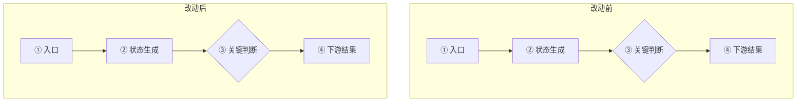

# 同事 PR 第一性审查

目标不是替同事证明方案正确，也不是为了显得严格而强行找问题。目标是在有限时间内回答六件事：这块功能负责什么、实际出了什么问题、根因是什么、代码链路怎样变化、PR 改得是否合理、还有没有必须修正或补证的地方。

默认输出短报告。只保留会改变合并决定或后续验证方式的信息；普通格式偏好、无影响的命名意见和假设性风险不占正文。

## 输入与边界

最低输入是：

- 需求背景；
- CodeUp PR 链接。

可选输入包括 OA 需求/缺陷 ID、project ID、Chat ID、环境、复现步骤、日志、同事判断的根因和改动方案。

缺少可选输入时继续做能完成的静态审查，不把可自行检查的问题反问用户。只有 PR 无法访问、关键仓库无法定位，或某个缺失选择会实质改变审查对象时才请求补充。

本 Skill 默认只读：

- 不修改代码、配置、数据库或文档；
- 不在 CodeUp 上评论、通过、关闭或合并 PR；
- 不 commit、push 或部署；
- 数据库只允许 SELECT；日志和配置只读取与当前假设有关的最小范围；
- 不在报告中回显 Token、Cookie、凭据、完整 Prompt 或未脱敏业务数据。

## 事实获取顺序

按成本从低到高取证，证据足够支撑结论就停止，不为低风险 PR 制造不成比例的调查。

### 1. 固定审查对象

1. 解析 PR 的仓库、源分支、目标分支、当前 patch set 和 commit。
2. 优先通过已登录的 CodeUp 页面或已配置的只读 OpenAPI 读取 PR 描述、提交、文件 diff、讨论和 CI；也可通过本地仓库和 Git 远端取得同一不可变 diff。
3. 若涉及远端现状，先检查本地 `git status`、分支和 worktree，再 `git fetch`，使用最新远端引用判断；不要覆盖未知改动。
4. 记录目标分支 commit 和 PR 源 commit。后续所有行号和代码片段必须来自这组审查对象。
5. PR diff 无法取得时，不根据标题或同事描述假装完成代码审查；输出阻塞原因，并请求 patch、可访问链接或仓库/分支信息。

### 2. 还原需求而不是复述需求

用大白话分别写清：

- **需求背景**：哪块功能本来负责什么；
- **问题描述**：在什么条件下，哪一步出现了什么偏离，造成什么实际影响；
- **同事根因假设**：同事明确写出的判断，或从其修改位置和方案反推的判断。反推时注明“从 PR 改动反推，原文未明示”。

背景不要提前塞入根因；问题描述不要只写“逻辑有问题”“体验不好”或函数名。

### 3. 建立最小完整机制

从业务目标出发，追踪与改动有关的真实链路：

```text
输入/触发
→ 生产者
→ 状态或数据变更
→ 消费者
→ 用户可见结果
→ 错误恢复、异步回填或终态
```

只检查有真实调用关系的集成点，重点包括：

- 入口、调用方和下游消费者；
- 状态生命周期、缓存、并发、幂等和恢复路径；
- API/schema、数据库脚本、配置、提示词、前后端和跨仓依赖；
- 权限、环境差异、兼容路径、监控、测试和上线配套；
- 项目内同类实现、现行规范和历史修复先例。

如果当前目录属于 GoalfyAI，按需读取最新 `goalfy-coding` 规范、知识库导航和 `goalfy-insight` 的当前根因/证据合同；这些资料用于形成和校验假设，不能代替本 PR 的代码与运行证据。

### 4. 独立判断根因

不要从“同事改了这里”倒推“这里一定是根因”。依次确认：

1. **现象**：用户或系统最终看到了什么；
2. **触发条件**：本次什么事件启动了异常链路；
3. **首次有意义的偏离**：最早哪个值、状态、分支或结果偏离预期；
4. **直接原因**：什么机制直接造成问题；
5. **系统根因**：现有约束、门禁、恢复或消费链为什么没有阻止直接原因；
6. **反事实**：若移除候选根因，是否应观察不到当前问题。

至少检查一个竞争解释，例如配置/版本不一致、调用方错误、外部依赖、权限、数据、模型决策或证据不足。结论分为：

- **一致**：同事判断和独立核验指向同一首次偏离与机制；
- **部分一致**：同事找对了直接原因，但漏了更早根因或影响范围；
- **不一致**：PR 修改点不能解释现象，或证据支持另一原因；
- **无法判断**：缺少会改变因果判断的决定性事实。

最新 `main` 只说明当前设计，不能证明某环境已经部署；代码默认值也不能冒充 Nacos、数据库、Hub 或环境变量的当前值。结论依赖运行时事实而输入未提供环境时，明确写“运行时未验证”。

### 5. 绘制代码链路与改动对比

先还原真实调用链和数据流，再绘图；不要从文件 diff 拼出一张看似完整但没有调用证据的图。图用于帮助零背景读者理解改动，不代替根因判断和代码证据。

优先使用 Mermaid `flowchart LR` 横向展示。采用两层结构：

1. **主链路**：用上下两个横向泳道分别展示“改动前”和“改动后”，相同业务阶段尽量对齐。每条主链保留 5～8 个节点，只表达入口、关键生产者、状态变化、决定性判断、消费者和最终结果。
2. **关键判断展开**：主链中的判断较复杂时，另画一张局部图，只展开 PR 修改的判断、造成问题的判断，以及影响成功、失败或恢复路径的判断。未修改且与结论无关的分支合并为“既有校验（未修改）”或“其他正常路径保持不变”。

主图可使用以下骨架：外层 `TB` 负责上下排列两个泳道，泳道内部 `LR` 保持业务链横向。根据真实代码替换节点，不要照抄示意内容。



一张图最多放 3 个判断节点；超过时拆成主链和一个或多个局部判断图，不画完整控制流图。跨文件、模块或仓库时使用 `subgraph` 标出边界，但仍保持一条从左到右的业务主线。节点标签先写业务含义，必要时再补函数或状态名，避免只写陌生代码标识符。

图中用编号 `①②③` 关联后面的代码证据，并保持统一语义：

- 灰色：未修改链路；
- 红色或虚线：原问题路径、被删除路径；
- 绿色：新增或修复路径；
- 黄色菱形：关键判断；
- 虚线边框：根据改动推断但未由调用链或运行证据确认的节点，并明确标“推断，未验证”。

每个关键节点都要能追溯到锁定审查对象中的真实代码。代码证据注明仓库、文件、函数和行号；改动前引用目标分支 commit，改动后引用 PR 源 commit。片段每段通常 5～12 行、最多 3 段，只截取决定行为的部分。不得把伪代码冒充真实代码；确需简化时标注“伪代码示意”。

若改动只有一个简单条件或单点字段调整，图不会增加理解价值，可以省略主图，直接用链路对比表和代码证据；不要为满足格式强行画图。

### 6. 审查改动与遗漏

把 PR 视为一个待证伪方案：

- 改动是否截断了已确认的因果链，而不是只隐藏症状；
- 正常路径、失败路径和恢复路径是否都保持正确；
- 设计写到的检查是否全部实现；
- 是否混入无关重构、未来兼容或另一个需求；
- 新增状态、字段、API 或表是否有完整生产者和消费者；
- 测试是否覆盖复现条件、正常路径和关键回归；
- CI 通过是否真的覆盖该风险，还是只有形式上的绿灯。

先寻找能推翻每条候选 finding 的反证。只有满足以下条件才写进正式问题：

- 能指向具体文件、行号、配置、日志或运行事实；
- 有可达路径或明确消费者；
- 能说明触发条件和实际影响；
- 修正它会改变合并决定或验证方式。

不要规定必须找到问题。默认最多展开 3 个正式问题，按“阻塞 / 建议”分级；其余不影响正确性的观察可省略。

## 结论口径

- **合理**：未发现阻塞问题，根因和改动链路有足够证据；
- **基本合理，需补充**：主体正确，但有非阻塞遗漏、测试或说明需要补齐；
- **需要修正**：存在可复现或可达的正确性问题，合并前应修复；
- **证据不足**：PR/diff 不可得，或缺少会实质改变根因判断的运行时事实。

“证据不足”不是找不到问题时的兜底。静态证据足以判断的内容仍要给出明确结论，只把依赖缺失事实的部分标记未验证。

## 输出格式

使用下面结构，但让内容自然、紧凑。没有正式问题时删除“发现的问题”；没有必要代码片段时不贴代码。

```markdown
# Review 结论

结论：合理 / 基本合理，需补充 / 需要修正 / 证据不足
仓库：<repo>
PR：<url>

## 需求背景
<两三句话，让不了解需求的人知道是哪块功能>

## 问题描述
<触发条件 → 哪一步出错 → 实际影响>

## 根因判断
<独立确认的根因；无法闭合时明确缺什么事实>

| 对比项 | 同事判断 | 复核结论 |
|---|---|---|
| 根因 | <原文或从 PR 反推> | 一致 / 部分一致 / 不一致 / 无法判断：<一句理由> |

## 代码链路与改动对比

### 主链路

<优先使用横向双泳道 Mermaid 图；简单单点改动可省略，并说明原因>

### 关键判断展开

<仅在主链包含复杂判断时绘制局部横向图；否则删除本节>

| 链路 | 改动前 | 改动后 | 判断 |
|---|---|---|---|
| <关键节点> | <原逻辑> | <新逻辑> | <是否截断根因及副作用> |

### 关键代码证据

| 图中节点 | 仓库 / 文件 / 函数 | 版本 | 业务含义 |
|---|---|---|---|
| <①> | `<repo/path:function:line>` | <目标分支 commit / PR commit> | <这段代码决定什么> |

<按需附最多 3 段关键代码；每段注明来源和版本>

## 发现的问题

1. [阻塞/建议] `<file:line>`：<问题、触发条件和影响>。建议：<最小修正或验证方式>。

## 验证情况
已验证：<diff、调用链、规范、测试、日志或配置>
未验证：<只列可能改变结论的缺口；没有则写“无关键缺口”>
```

先给结论，不复述调查过程，不罗列完整检查清单。图、表和代码片段只服务于理解根因与改动；如果它们表达的是同一件事，保留最清楚的一种，不重复堆砌。

## 完成检查

交付前确认：

- 背景、问题和根因没有互相重复或偷换；
- 同事的判断被当作假设独立核验；
- PR diff、目标分支和必要运行时事实没有混为一谈；
- 链路图来自真实调用关系，复杂判断已拆分，节点能追溯到具体代码和版本；
- 每个正式问题都有位置、可达路径、触发条件和影响；
- 没有为了“审出问题”制造低置信度 finding；
- 输出让零背景读者在几分钟内能决定是否通过、退回或补证。
